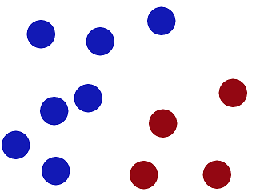
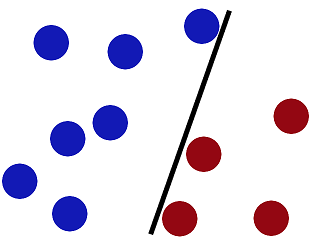
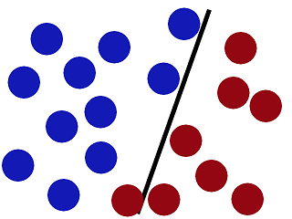
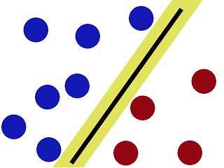
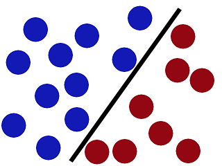
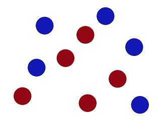
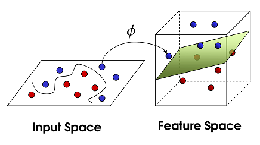
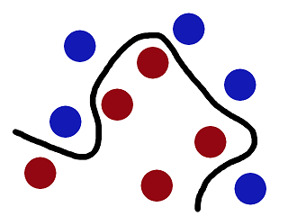

Project 2 from [Udacity's Machine Learning Engineer Nanodegree](https://www.udacity.com/course/machine-learning-engineer-nanodegree--nd009)

<b>This Project Has Been Confirmed As Successful By A Udacity Reviewer.</b>

## Building a Student Intervention System

# Intro

<h3> Project Overview </h3>

As education has grown to rely more on technology, vast amounts of data has become available for examination and prediction. Logs of student activities, grades, interactions with teachers and fellow students, and more, are now captured in real time through learning management systems like Canvas and Edmodo. This is especially true for online classrooms, which are becoming popular even at the primary and secondary school level. Within all levels of education, there exists a push to help increase the likelihood of student success, without watering down the education or engaging in behaviors that fail to improve the underlying issues. Graduation rates are often the criteria of choice, and educators seek new ways to predict the success and failure of students early enough to stage effective interventions.

A local school district has a goal to reach a 95% graduation rate by the end of the decade by identifying students who need intervention before they drop out of school. As a software engineer contacted by the school district, your task is to model the factors that predict how likely a student is to pass their high school final exam, by constructing an intervention system that leverages supervised learning techniques. The board of supervisors has asked that you find the most effective model that uses the least amount of computation costs to save on the budget. You will need to analyze the dataset on students' performance and develop a model that will predict the likelihood that a given student will pass, quantifying whether an intervention is necessary.

# Project

Welcome to the second project of the Machine Learning Engineer Nanodegree! In this notebook, some template code has already been provided for you, and it will be your job to implement the additional functionality necessary to successfully complete this project. Sections that begin with **'Implementation'** in the header indicate that the following block of code will require additional functionality which you must provide. Instructions will be provided for each section and the specifics of the implementation are marked in the code block with a `'TODO'` statement. Please be sure to read the instructions carefully!

In addition to implementing code, there will be questions that you must answer which relate to the project and your implementation. Each section where you will answer a question is preceded by a **'Question X'** header. Carefully read each question and provide thorough answers in the following text boxes that begin with **'Answer:'**. Your project submission will be evaluated based on your answers to each of the questions and the implementation you provide.  

>**Note:** Code and Markdown cells can be executed using the **Shift + Enter** keyboard shortcut. In addition, Markdown cells can be edited by typically double-clicking the cell to enter edit mode.

### Question 1 - Classification vs. Regression
*Your goal for this project is to identify students who might need early intervention before they fail to graduate. Which type of supervised learning problem is this, classification or regression? Why?*

**Answer: ** 

The school wants to know in advance if a student needs an intervention, so the possible outputs are two labels, for example: 'NEEDS INTERVENTION' or 'DOESN'T NEED INTERVENTION'. This is a typical classification problem, more specifically a binary classification problem.

## Exploring the Data
Run the code cell below to load necessary Python libraries and load the student data. Note that the last column from this dataset, `'passed'`, will be our target label (whether the student graduated or didn't graduate). All other columns are features about each student.


```python
# Import libraries
import numpy as np
import pandas as pd
from time import time
from sklearn.metrics import f1_score

# Read student data
student_data = pd.read_csv("student-data.csv")
#student_data = pd.read_csv("C:\Users\jcsastre\machine-learning\projects\student_intervention\student-data.csv")
#student_data = pd.read_csv("/home/jcsastre/machine-learning/projects/student_intervention/student-data.csv")
print "Student data read successfully!"
```

    Student data read successfully!
    

### Implementation: Data Exploration
Let's begin by investigating the dataset to determine how many students we have information on, and learn about the graduation rate among these students. In the code cell below, you will need to compute the following:
- The total number of students, `n_students`.
- The total number of features for each student, `n_features`.
- The number of those students who passed, `n_passed`.
- The number of those students who failed, `n_failed`.
- The graduation rate of the class, `grad_rate`, in percent (%).


```python
# TODO: Calculate number of students
n_students = student_data.shape[0]

# TODO: Calculate number of features
n_features = student_data.shape[1] - 1

# TODO: Calculate passing students
n_passed = student_data[student_data.passed == 'yes'].shape[0]

# TODO: Calculate failing students
n_failed = student_data[student_data.passed == 'no'].shape[0]

# TODO: Calculate graduation rate
grad_rate = 100 * (n_passed / float(n_students))

# Print the results
print "Total number of students: {}".format(n_students)
print "Number of features: {}".format(n_features)
print "Number of students who passed: {}".format(n_passed)
print "Number of students who failed: {}".format(n_failed)
print "Graduation rate of the class: {:.2f}%".format(grad_rate)
```

    Total number of students: 395
    Number of features: 30
    Number of students who passed: 265
    Number of students who failed: 130
    Graduation rate of the class: 67.09%
    


```python
# Extract feature columns
feature_cols = list(student_data.columns[:-1])

# Extract target column 'passed'
target_col = student_data.columns[-1] 

# Show the list of columns
print "Feature columns:\n{}".format(feature_cols)
print "\nTarget column: {}".format(target_col)

# Separate the data into feature data and target data (X_all and y_all, respectively)
X_all = student_data[feature_cols]
y_all = student_data[target_col]

# Show the feature information by printing the first five rows
print "\nFeature values:"
print X_all.head()
```

    Feature columns:
    ['school', 'sex', 'age', 'address', 'famsize', 'Pstatus', 'Medu', 'Fedu', 'Mjob', 'Fjob', 'reason', 'guardian', 'traveltime', 'studytime', 'failures', 'schoolsup', 'famsup', 'paid', 'activities', 'nursery', 'higher', 'internet', 'romantic', 'famrel', 'freetime', 'goout', 'Dalc', 'Walc', 'health', 'absences']
    
    Target column: passed
    
    Feature values:
      school sex  age address famsize Pstatus  Medu  Fedu     Mjob      Fjob  \
    0     GP   F   18       U     GT3       A     4     4  at_home   teacher   
    1     GP   F   17       U     GT3       T     1     1  at_home     other   
    2     GP   F   15       U     LE3       T     1     1  at_home     other   
    3     GP   F   15       U     GT3       T     4     2   health  services   
    4     GP   F   16       U     GT3       T     3     3    other     other   
    
        ...    higher internet  romantic  famrel  freetime goout Dalc Walc health  \
    0   ...       yes       no        no       4         3     4    1    1      3   
    1   ...       yes      yes        no       5         3     3    1    1      3   
    2   ...       yes      yes        no       4         3     2    2    3      3   
    3   ...       yes      yes       yes       3         2     2    1    1      5   
    4   ...       yes       no        no       4         3     2    1    2      5   
    
      absences  
    0        6  
    1        4  
    2       10  
    3        2  
    4        4  
    
    [5 rows x 30 columns]
    

### Preprocess Feature Columns

As you can see, there are several non-numeric columns that need to be converted! Many of them are simply `yes`/`no`, e.g. `internet`. These can be reasonably converted into `1`/`0` (binary) values.

Other columns, like `Mjob` and `Fjob`, have more than two values, and are known as _categorical variables_. The recommended way to handle such a column is to create as many columns as possible values (e.g. `Fjob_teacher`, `Fjob_other`, `Fjob_services`, etc.), and assign a `1` to one of them and `0` to all others.

These generated columns are sometimes called _dummy variables_, and we will use the [`pandas.get_dummies()`](http://pandas.pydata.org/pandas-docs/stable/generated/pandas.get_dummies.html?highlight=get_dummies#pandas.get_dummies) function to perform this transformation. Run the code cell below to perform the preprocessing routine discussed in this section.


```python
def preprocess_features(X):
    ''' Preprocesses the student data and converts non-numeric binary variables into
        binary (0/1) variables. Converts categorical variables into dummy variables. '''
    
    # Initialize new output DataFrame
    output = pd.DataFrame(index = X.index)

    # Investigate each feature column for the data
    for col, col_data in X.iteritems():
        
        # If data type is non-numeric, replace all yes/no values with 1/0
        if col_data.dtype == object:
            col_data = col_data.replace(['yes', 'no'], [1, 0])

        # If data type is categorical, convert to dummy variables
        if col_data.dtype == object:
            # Example: 'school' => 'school_GP' and 'school_MS'
            col_data = pd.get_dummies(col_data, prefix = col)  
        
        # Collect the revised columns
        output = output.join(col_data)
    
    return output

X_all = preprocess_features(X_all)
print "Processed feature columns ({} total features):\n{}".format(len(X_all.columns), list(X_all.columns))
```

    Processed feature columns (48 total features):
    ['school_GP', 'school_MS', 'sex_F', 'sex_M', 'age', 'address_R', 'address_U', 'famsize_GT3', 'famsize_LE3', 'Pstatus_A', 'Pstatus_T', 'Medu', 'Fedu', 'Mjob_at_home', 'Mjob_health', 'Mjob_other', 'Mjob_services', 'Mjob_teacher', 'Fjob_at_home', 'Fjob_health', 'Fjob_other', 'Fjob_services', 'Fjob_teacher', 'reason_course', 'reason_home', 'reason_other', 'reason_reputation', 'guardian_father', 'guardian_mother', 'guardian_other', 'traveltime', 'studytime', 'failures', 'schoolsup', 'famsup', 'paid', 'activities', 'nursery', 'higher', 'internet', 'romantic', 'famrel', 'freetime', 'goout', 'Dalc', 'Walc', 'health', 'absences']
    

### Implementation: Training and Testing Data Split
So far, we have converted all _categorical_ features into numeric values. For the next step, we split the data (both features and corresponding labels) into training and test sets. In the following code cell below, you will need to implement the following:
- Randomly shuffle and split the data (`X_all`, `y_all`) into training and testing subsets.
  - Use 300 training points (approximately 75%) and 95 testing points (approximately 25%).
  - Set a `random_state` for the function(s) you use, if provided.
  - Store the results in `X_train`, `X_test`, `y_train`, and `y_test`.


```python
# TODO: Import any additional functionality you may need here
from sklearn.cross_validation import train_test_split

# TODO: Set the number of training points
num_train = 300

# Set the number of testing points
num_test = X_all.shape[0] - num_train

# TODO: Shuffle and split the dataset into the number of training and testing points above
X_train, X_test, y_train, y_test = train_test_split(X_all, y_all, test_size=num_test, train_size=num_train, random_state=9)

# Show the results of the split
print "Training set has {} samples.".format(X_train.shape[0])
print "Testing set has {} samples.".format(X_test.shape[0])
```

    Training set has 300 samples.
    Testing set has 95 samples.
    

## Training and Evaluating Models
In this section, you will choose 3 supervised learning models that are appropriate for this problem and available in `scikit-learn`. You will first discuss the reasoning behind choosing these three models by considering what you know about the data and each model's strengths and weaknesses. You will then fit the model to varying sizes of training data (100 data points, 200 data points, and 300 data points) and measure the F<sub>1</sub> score. You will need to produce three tables (one for each model) that shows the training set size, training time, prediction time, F<sub>1</sub> score on the training set, and F<sub>1</sub> score on the testing set.

**The following supervised learning models are currently available in** [`scikit-learn`](http://scikit-learn.org/stable/supervised_learning.html) **that you may choose from:**
- Gaussian Naive Bayes (GaussianNB)
- Decision Trees
- Ensemble Methods (Bagging, AdaBoost, Random Forest, Gradient Boosting)
- K-Nearest Neighbors (KNeighbors)
- Stochastic Gradient Descent (SGDC)
- Support Vector Machines (SVM)
- Logistic Regression

### Question 2 - Model Application
*List three supervised learning models that are appropriate for this problem. For each model chosen*
- Describe one real-world application in industry where the model can be applied. *(You may need to do a small bit of research for this — give references!)* 
- What are the strengths of the model; when does it perform well? 
- What are the weaknesses of the model; when does it perform poorly?
- What makes this model a good candidate for the problem, given what you know about the data?

**Answer: **

##### 1. SVM
- Real-world application

   Reference: [Classification of multiple cancer types by multicategory support vector machines using gene expression data](http://bioinformatics.oxfordjournals.org/content/19/9/1132)

   This article explains SVM is one of the classification methods successfully applied to the cancer diagnosis problems.


- Strengths

   Works fine with small amounts of data, even when the number of features is greater than the number of samples. Maximizes the margin between decision boundary and closest data. Outliers doesn't affect the result.


- Weaknesses

   Perform poorly in very large data sets or with lots of noise. In non linear scenarios, try to figure what is the best kernel can be difficult. Needs tuning of parameters. Doesn't directly provide a probability estimate for predictions.


- What make this model a good candidate

   Whe have a relative high number of features compared to the dataset, and SVM is specially strong on these scenarios.

##### 2. Logistic Regression
- Real-world application

   Reference: [Real-world application: Prediction of roof fall risks in bord and pillar workings in coal mines.](http://www.sciencedirect.com/science/article/pii/S0925753508000118)

   This paper attempts to predict the severities of roof fall accidents based on some major contributing parameters using the binary logistic regression model.


- Strengths

   Have low computational requirements. Performs well on small and large datasets. Is easy to see the assigned weight for each of the features.


- Weaknesses

   Performs poorly with high number of features or missing data. Irrelevant features will produce undesired effects. Outliers are a problem because it tries to maximize likelihood using all training data.


- What make this model a good candidate

  We need to perform binary classification, and Logistic Regression is particulary strong on this area.


##### 3. K-Nearest Neighbors
- Real-world application

   Reference: [Application of K-nearest neighbors algorithm on breast cancer diagnosis problem.](http://www.ncbi.nlm.nih.gov/pmc/articles/PMC2243774)

   This paper addresses the Breast Cancer diagnosis problem as a pattern classification problem.  Conceptually and implementation-wise, the K-nearest neighbors algorithm is simpler than the other techniques that have been applied to this problem. 


- Strengths

   Training has no cost. Works fine with noisy data. No understanding of the data is needed.


- Weaknesses

   Needs memory to store all the data. Slower on predictions. All feature have the same weight.


- What make this model a good candidate

   As the available data is small, makes sense to keep it all to make predictions instead of generate a model.

### Setup
Run the code cell below to initialize three helper functions which you can use for training and testing the three supervised learning models you've chosen above. The functions are as follows:
- `train_classifier` - takes as input a classifier and training data and fits the classifier to the data.
- `predict_labels` - takes as input a fit classifier, features, and a target labeling and makes predictions using the F<sub>1</sub> score.
- `train_predict` - takes as input a classifier, and the training and testing data, and performs `train_clasifier` and `predict_labels`.
 - This function will report the F<sub>1</sub> score for both the training and testing data separately.


```python
def train_classifier(clf, X_train, y_train):
    ''' Fits a classifier to the training data. '''
    
    # Start the clock, train the classifier, then stop the clock
    start = time()
    clf.fit(X_train, y_train)
    end = time()
    
    # Print the results
    print "Trained model in {:.4f} seconds".format(end - start)

    
def predict_labels(clf, features, target):
    ''' Makes predictions using a fit classifier based on F1 score. '''
    
    # Start the clock, make predictions, then stop the clock
    start = time()
    y_pred = clf.predict(features)
    end = time()
    
    # Print and return results
    print "Made predictions in {:.4f} seconds.".format(end - start)
    return f1_score(target.values, y_pred, pos_label='yes')


def train_predict(clf, X_train, y_train, X_test, y_test):
    ''' Train and predict using a classifer based on F1 score. '''
    
    # Indicate the classifier and the training set size
    print "Training a {} using a training set size of {}. . .".format(clf.__class__.__name__, len(X_train))
    
    # Train the classifier
    train_classifier(clf, X_train, y_train)
    
    # Print the results of prediction for both training and testing
    print "F1 score for training set: {:.4f}.".format(predict_labels(clf, X_train, y_train))
    print "F1 score for test set: {:.4f}.".format(predict_labels(clf, X_test, y_test))
```

### Implementation: Model Performance Metrics
With the predefined functions above, you will now import the three supervised learning models of your choice and run the `train_predict` function for each one. Remember that you will need to train and predict on each classifier for three different training set sizes: 100, 200, and 300. Hence, you should expect to have 9 different outputs below — 3 for each model using the varying training set sizes. In the following code cell, you will need to implement the following:
- Import the three supervised learning models you've discussed in the previous section.
- Initialize the three models and store them in `clf_A`, `clf_B`, and `clf_C`.
 - Use a `random_state` for each model you use, if provided.
 - **Note:** Use the default settings for each model — you will tune one specific model in a later section.
- Create the different training set sizes to be used to train each model.
 - *Do not reshuffle and resplit the data! The new training points should be drawn from `X_train` and `y_train`.*
- Fit each model with each training set size and make predictions on the test set (9 in total).  
**Note:** Three tables are provided after the following code cell which can be used to store your results.


```python
# TODO: Import the three supervised learning models from sklearn
from sklearn import svm
from sklearn import linear_model
from sklearn import neighbors

# TODO: Initialize the three models
clf_A = svm.SVC()
clf_B = linear_model.LogisticRegression()
clf_C = neighbors.KNeighborsClassifier()

# TODO: Set up the training set sizes
X_train_100 = X_train[:100]
y_train_100 = y_train[:100]

X_train_200 = X_train[:200]
y_train_200 = y_train[:200]

X_train_300 = X_train
y_train_300 = y_train

# TODO: Execute the 'train_predict' function for each classifier and each training set size
# train_predict(clf, X_train, y_train, X_test, y_test)
train_predict(clf_A, X_train_100, y_train_100, X_test, y_test)
print
train_predict(clf_A, X_train_200, y_train_200, X_test, y_test)
print
train_predict(clf_A, X_train_300, y_train_300, X_test, y_test)
print
print "---------------"
print
train_predict(clf_B, X_train_100, y_train_100, X_test, y_test)
print
train_predict(clf_B, X_train_200, y_train_200, X_test, y_test)
print
train_predict(clf_B, X_train_300, y_train_300, X_test, y_test)
print
print "---------------"
print
train_predict(clf_C, X_train_100, y_train_100, X_test, y_test)
print
train_predict(clf_C, X_train_200, y_train_200, X_test, y_test)
print
train_predict(clf_C, X_train_300, y_train_300, X_test, y_test)
```

    Training a SVC using a training set size of 100. . .
    Trained model in 0.0010 seconds
    Made predictions in 0.0010 seconds.
    F1 score for training set: 0.9041.
    Made predictions in 0.0010 seconds.
    F1 score for test set: 0.8375.
    
    Training a SVC using a training set size of 200. . .
    Trained model in 0.0030 seconds
    Made predictions in 0.0020 seconds.
    F1 score for training set: 0.8669.
    Made predictions in 0.0010 seconds.
    F1 score for test set: 0.8442.
    
    Training a SVC using a training set size of 300. . .
    Trained model in 0.0080 seconds
    Made predictions in 0.0060 seconds.
    F1 score for training set: 0.8472.
    Made predictions in 0.0020 seconds.
    F1 score for test set: 0.8387.
    
    ---------------
    
    Training a LogisticRegression using a training set size of 100. . .
    Trained model in 0.0010 seconds
    Made predictions in 0.0000 seconds.
    F1 score for training set: 0.9130.
    Made predictions in 0.0010 seconds.
    F1 score for test set: 0.7970.
    
    Training a LogisticRegression using a training set size of 200. . .
    Trained model in 0.0030 seconds
    Made predictions in 0.0000 seconds.
    F1 score for training set: 0.8539.
    Made predictions in 0.0000 seconds.
    F1 score for test set: 0.7826.
    
    Training a LogisticRegression using a training set size of 300. . .
    Trained model in 0.0040 seconds
    Made predictions in 0.0010 seconds.
    F1 score for training set: 0.8258.
    Made predictions in 0.0000 seconds.
    F1 score for test set: 0.8261.
    
    ---------------
    
    Training a KNeighborsClassifier using a training set size of 100. . .
    Trained model in 0.0010 seconds
    Made predictions in 0.0020 seconds.
    F1 score for training set: 0.8667.
    Made predictions in 0.0010 seconds.
    F1 score for test set: 0.8235.
    
    Training a KNeighborsClassifier using a training set size of 200. . .
    Trained model in 0.0010 seconds
    Made predictions in 0.0050 seconds.
    F1 score for training set: 0.8256.
    Made predictions in 0.0020 seconds.
    F1 score for test set: 0.8056.
    
    Training a KNeighborsClassifier using a training set size of 300. . .
    Trained model in 0.0010 seconds
    Made predictions in 0.0080 seconds.
    F1 score for training set: 0.8710.
    Made predictions in 0.0030 seconds.
    F1 score for test set: 0.8108.
    

### Tabular Results
Edit the cell below to see how a table can be designed in [Markdown](https://github.com/adam-p/markdown-here/wiki/Markdown-Cheatsheet#tables). You can record your results from above in the tables provided.

** Classifer 1 - Support Vector Machine **  

| Training Set Size | Training Time | Prediction Time (test) | F1 Score (train) | F1 Score (test) |
| :---------------: | :---------------------: | :--------------------: | :--------------: | :-------------: |
| 100               | 0.0030 | 0.0010 | 0.9041 | 0.8375 |
| 200               | 0.0030 | 0.0020 | 0.8669 | 0.8442 |
| 300               | 0.0060 | 0.0050 | 0.8472 | 0.8387 |

** Classifer 2 - Logistic Regression **  

| Training Set Size | Training Time | Prediction Time (test) | F1 Score (train) | F1 Score (test) |
| :---------------: | :---------------------: | :--------------------: | :--------------: | :-------------: |
| 100               | 0.0270 | 0.0140 | 0.9130 | 0.7970 |
| 200               | 0.0020 | 0.0000 | 0.8539 | 0.7826 |
| 300               | 0.0030 | 0.0000 | 0.8258 | 0.8261 |

** Classifer 3 - K-Nearest Neighbors **  

| Training Set Size | Training Time | Prediction Time (test) | F1 Score (train) | F1 Score (test) |
| :---------------: | :---------------------: | :--------------------: | :--------------: | :-------------: |
| 100               | 0.0010 | 0.0020 | 0.8667 | 0.8235 |
| 200               | 0.0010 | 0.0030 | 0.8256 | 0.8056 |
| 300               | 0.0010 | 0.0050 | 0.8710 | 0.8108 |

## Choosing the Best Model
In this final section, you will choose from the three supervised learning models the *best* model to use on the student data. You will then perform a grid search optimization for the model over the entire training set (`X_train` and `y_train`) by tuning at least one parameter to improve upon the untuned model's F<sub>1</sub> score. 

### Question 3 - Choosing the Best Model
*Based on the experiments you performed earlier, in one to two paragraphs, explain to the board of supervisors what single model you chose as the best model. Which model is generally the most appropriate based on the available data, limited resources, cost, and performance?*

**Answer: **

Three classification models has been applied to the provided data: Support Vector Machine, Logistic Regression and Random Forest. These classification models are very robust, and has been widely used on classification scenarios.

Training time, prediction time and result score has been analyzed on these three models, and Support Vector Machine gets the better results. As the dataset will be relative small, predictions can be done with small computation resources.

### Question 4 - Model in Layman's Terms
*In one to two paragraphs, explain to the board of directors in layman's terms how the final model chosen is supposed to work. Be sure that you are describing the major qualities of the model, such as how the model is trained and how the model makes a prediction. Avoid using advanced mathematical or technical jargon, such as describing equations or discussing the algorithm implementation.*

**Answer: **

(My answer is based on an explanation from reddit: [Please explain Support Vector Machines (SVM) like I am a 5 year old.](https://www.reddit.com/r/MachineLearning/comments/15zrpp/please_explain_support_vector_machines_svm_like_i/))

We want to classify students on students that need intervention, and students that doesn't need intervention.

At the present time we have information of past students (age, gender, family, etc), and for each student we know if it passed or not.

We will create a prediction model that will allow to predict if a student will pass or not. If the prediction says student will fail, then intervention will be done on this student.

The prediction model will be created using the SVM algorithm, and we will train it with the data of the past students.

The model that SVM will produce can be represented as boundary that separates students that passed and those who did not.

Now imagine a table where blue balls are students that need intervention, and red balls are students that doesn't need intervention:



We get a stick and put it on the table to separate him. This is stick is the boundary (model) that classify students:



Now lets place more balls on the table, it kind of works but one of the balls is on the wrong side and there is probably a better place to put the stick now:



SVMs try to put the stick (model) in the best possible place by having as big a gap on either side of the stick as possible:



Now we add more balls, but the stick is still in a pretty good spot:



Often is not easy to create a boundary in low dimensions, but SVM performs great on these scenarios because uses a trick.

To understand this let's complicate the arrangemente of balls:



Then, what SVM's do is throwing the balls into the air. Then, it grab a sheet of paper (hyperplane) and slip it between the balls.



Now, looking at the balls from the original perspective, the balls will look split by some curvy line, that is the model generated by SVM.



Now, when we have information of new students, we can pass this information to the SVM with the model generated based on information of past students, and it will predict if the student needs or not intervention.

### Implementation: Model Tuning
Fine tune the chosen model. Use grid search (`GridSearchCV`) with at least one important parameter tuned with at least 3 different values. You will need to use the entire training set for this. In the code cell below, you will need to implement the following:
- Import [`sklearn.grid_search.gridSearchCV`](http://scikit-learn.org/stable/modules/generated/sklearn.grid_search.GridSearchCV.html) and [`sklearn.metrics.make_scorer`](http://scikit-learn.org/stable/modules/generated/sklearn.metrics.make_scorer.html).
- Create a dictionary of parameters you wish to tune for the chosen model.
 - Example: `parameters = {'parameter' : [list of values]}`.
- Initialize the classifier you've chosen and store it in `clf`.
- Create the F<sub>1</sub> scoring function using `make_scorer` and store it in `f1_scorer`.
 - Set the `pos_label` parameter to the correct value!
- Perform grid search on the classifier `clf` using `f1_scorer` as the scoring method, and store it in `grid_obj`.
- Fit the grid search object to the training data (`X_train`, `y_train`), and store it in `grid_obj`.


```python
# TODO: Import 'GridSearchCV' and 'make_scorer'
from sklearn import grid_search
from sklearn import metrics

# TODO: Create the parameters list you wish to tune
parameters = [{
    'C': [0.001, 0.01, 0.1, 1, 10, 100, 1000],
    'kernel': ['linear', 'poly', 'rbf', 'sigmoid'],
    'gamma': [0.001, 0.01, 0.1, 1, 10, 100, 1000]
 }]

# TODO: Initialize the classifier
clf = svm.SVC()

# TODO: Make an f1 scoring function using 'make_scorer' 
f1_scorer = metrics.make_scorer(metrics.f1_score, pos_label='yes')

# TODO: Perform grid search on the classifier using the f1_scorer as the scoring method
grid_obj = grid_search.GridSearchCV(clf, parameters, f1_scorer)

# TODO: Fit the grid search object to the training data and find the optimal parameters
grid_obj = grid_obj.fit(X_train, y_train)

# Get the estimator
clf = grid_obj.best_estimator_

# Report the final F1 score for training and testing after parameter tuning
print "Tuned model has a training F1 score of {:.4f}.".format(predict_labels(clf, X_train, y_train))
print "Tuned model has a testing F1 score of {:.4f}.".format(predict_labels(clf, X_test, y_test))
```

    Made predictions in 0.0060 seconds.
    Tuned model has a training F1 score of 0.9774.
    Made predictions in 0.0030 seconds.
    Tuned model has a testing F1 score of 0.8519.
    

### Question 5 - Final F<sub>1</sub> Score
*What is the final model's F<sub>1</sub> score for training and testing? How does that score compare to the untuned model?*

**Answer: **

The final model's F1 score for training is 0.9774, and for testing is 0.8519. Compared to the untuned model, the score has improved a lot for training, and a little bit for testing.

> **Note**: Once you have completed all of the code implementations and successfully answered each question above, you may finalize your work by exporting the iPython Notebook as an HTML document. You can do this by using the menu above and navigating to  
**File -> Download as -> HTML (.html)**. Include the finished document along with this notebook as your submission.
